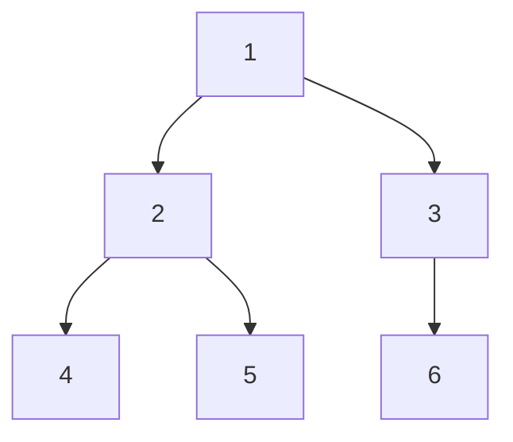

# DSA Practice (Kotlin)

This repository contains Kotlin implementations of classic data structures and algorithms. Currently implemented:

- Quick Sort (`QuickSort.kt`)
- Binary Search (`BinarySearch.kt`)
- Binary Tree Traversals: Pre-Order, In-Order, Post-Order (`TraversingBinaryTrees.kt`)

Below you'll find for each algorithm:
- High-level description
- Time & space complexity
- Step-by-step visualization (ASCII)
- Mermaid diagram (rendered automatically on GitHub)
- Example run matching `Main.kt`

---
## Running the project

```bash
./gradlew run
```
(Or open in IntelliJ IDEA and run `main` in `Main.kt`.)

---
## Quick Sort

In-place, divide-and-conquer sorting algorithm. (Implementation here appears to return a new sorted array; adjust description if you change strategy.)

### Complexities
- Average Time: O(n log n)
- Worst Time: O(n²) (already sorted / all equal with naive pivot choice)
- Best Time: O(n log n)
- Space: O(log n) recursion depth (plus copies if implemented non in-place)

### Idea
1. Choose a pivot
2. Partition elements into: less-than, equal-to, greater-than pivot
3. Recursively sort partitions
4. Concatenate

### Example: Sorting `[34, 7, 23, 32, 5, 62]`
Assuming first element is pivot each recursive level.

```
[34, 7, 23, 32, 5, 62]
 pivot=34
 < : [7, 23, 32, 5]
 = : [34]
 > : [62]
---------------------------------
Sort [7, 23, 32, 5]
 [7, 23, 32, 5]
  pivot=7
  < : [ ]
  = : [7]
  > : [23, 32, 5]
  -> becomes [7, sort(23,32,5)]
   [23, 32, 5]
    pivot=23
    < : [ ]
    = : [23]
    > : [32, 5]
     [32, 5]
      pivot=32
      < : [5]
      = : [32]
      > : [ ] -> [5, 32]
    -> [23, 5, 32]
  -> [7, 23, 5, 32]
Normalize inner partitions (after recursive concatenations):
 [7, 23, 5, 32] -> [7, 5, 23, 32] -> [5, 7, 23, 32]
---------------------------------
Final concatenation:
 [5, 7, 23, 32] + [34] + [62] = [5, 7, 23, 32, 34, 62]
```

### Mermaid (high-level recursion tree)


---
## Binary Search

Searches for a target in a sorted array by repeatedly halving the search interval.

### Complexities
- Time: O(log n)
- Space: O(1) (iterative) / O(log n) (recursive)

### Idea
1. Compute middle index
2. If middle == target -> found
3. If middle < target -> search right half
4. Else -> search left half

### Real-World Uses
- Git: `git bisect` uses binary search over commits to locate the introduction of a bug efficiently.
- Boundary / threshold discovery: Find the first (or last) element matching a predicate (e.g., first failing build number, first version with a regression).
- Autocomplete & dictionary lookups: Fast prefix or exact word location in sorted word lists / tries hybrid approaches.
- Time-series & logs: Locate the first event after a timestamp or bracket a time range.

### Example: Find 23 in `[5, 7, 23, 32, 34, 62]`
```
lo=0 hi=5  mid=(0+5)/2=2  arr[2]=23 -> FOUND
```

Longer example (target 32):
```
Array: [5, 7, 23, 32, 34, 62]
lo=0 hi=5 mid=2 val=23 (<32) -> lo=3
lo=3 hi=5 mid=4 val=34 (>32) -> hi=3
lo=3 hi=3 mid=3 val=32 == target -> FOUND index=3
```

### ASCII Visualization (target 32)
```
[5, 7, 23, 32, 34, 62]
 ^              ^
 lo=0           hi=5 mid=2 (23)

        Narrow right half
[32, 34, 62]
 ^        ^
 lo=3     hi=5 mid=4 (34)

Narrow left half
[32]
 ^
 lo=3 hi=3 mid=3 (32) -> success
```

---
## Binary Tree Traversals (Pre-Order, In-Order, Post-Order)

Traverse all nodes of a binary tree in different systematic orders. These depth-first traversals are fundamental building blocks for many tree-based algorithms (expression evaluation, serialization, BST operations, etc.). Implemented in `TraversingBinaryTrees.kt` using simple recursion.

### Traversal Orders
Given a node N, Left child L, Right child R:
- Pre-Order: Visit N, then traverse L, then traverse R  (N L R)
- In-Order: Traverse L, visit N, traverse R              (L N R)
- Post-Order: Traverse L, traverse R, visit N            (L R N)

### Complexities
- Time: O(n) (each node visited exactly once)
- Space: O(h) recursion stack where h is tree height (O(log n) for balanced, O(n) worst-case skewed)

### Example Tree
```
        1
       / \
      2   3
     / \   \
    4   5   6
```

Results:
- Pre-Order: 1 2 4 5 3 6
- In-Order: 4 2 5 1 3 6
- Post-Order: 4 5 2 6 3 1

### ASCII Traversal Trace (Pre-Order)
Call stack expansion (simplified):
```
visit 1
 visit 2
  visit 4
  backtrack 4
  visit 5
  backtrack 5
 backtrack 2
 visit 3
  visit 6
  backtrack 6
 backtrack 3
```
Output accumulation: [1,2,4,5,3,6]

### Mermaid Diagram (Tree Structure)


### Kotlin Usage
```kotlin
val root = TreeNode(1,
    left = TreeNode(2, TreeNode(4), TreeNode(5)),
    right = TreeNode(3, right = TreeNode(6))
)

print("Pre-Order: ")
preOrder(root) { print("${it.value} ") }
println()

print("In-Order: ")
inOrder(root) { print("${it.value} ") }
println()

print("Post-Order: ")
postOrder(root) { print("${it.value} ") }
println()
```
Expected output:
```
Pre-Order: 1 2 4 5 3 6 
In-Order: 4 2 5 1 3 6 
Post-Order: 4 5 2 6 3 1 
```

### Real-World Applications
- File System Traversal:
  - **Pre-order traversal** (folder-first): Root → Documents → report.pdf → notes.txt → Photos → vacation.jpg → family.png
  - **Post-order traversal** (used for deletion): Delete files first, then folders to avoid deleting non-empty directories
- Expression Evaluation:
  - **In-order traversal**: To reconstruct the original expression

---
## Adding New Algorithms
When you add a new `.kt` file implementing an algorithm:
1. Create a section in this README
2. Provide: description, complexities, visualization (ASCII + Mermaid), example
3. Keep formatting consistent

Suggested future additions:
- Merge Sort
- Heap Sort
- BFS / DFS
- Dijkstra's Algorithm
- Dynamic Programming examples

---
Happy coding!
