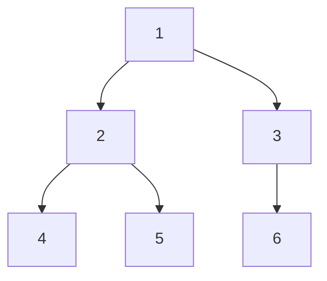
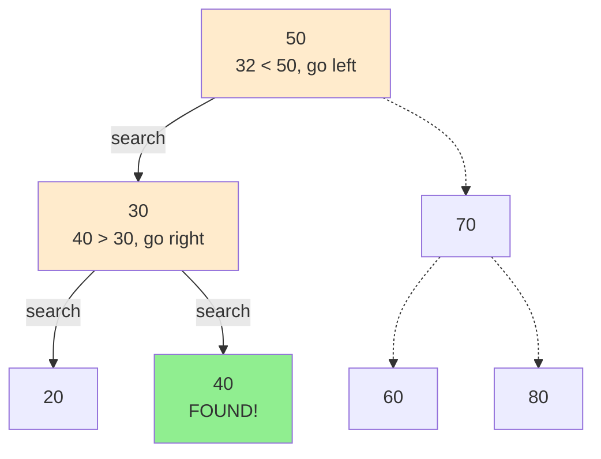
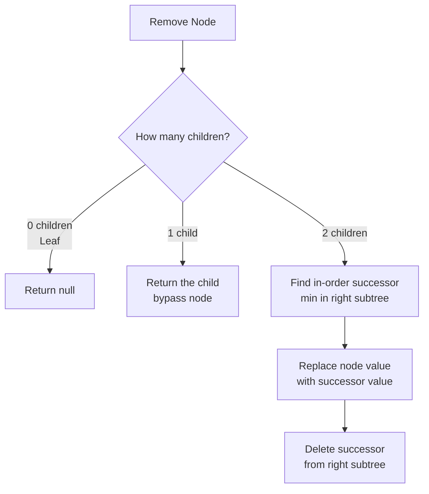

# DSA Practice (Kotlin)

This repository contains Kotlin implementations of classic data structures and algorithms. Currently implemented:

- Quick Sort (`QuickSort.kt`)
- Binary Search (`BinarySearch.kt`)
- Binary Tree Traversals: Pre-Order, In-Order, Post-Order (`TraversingBinaryTrees.kt`)
- Binary Search Tree: Search, Insert, Remove (`BinarySearchTree.kt`)

Below you'll find for each algorithm:
- High-level description
- Time & space complexity
- Step-by-step visualization (ASCII)
- Mermaid diagram (rendered automatically on GitHub)
- Example run matching `Main.kt`

---
## Running the project

```bash
./gradlew run
```
(Or open in IntelliJ IDEA and run `main` in `Main.kt`.)

---
## Quick Sort

In-place, divide-and-conquer sorting algorithm. (Implementation here appears to return a new sorted array; adjust description if you change strategy.)

### Complexities
- Average Time: O(n log n)
- Worst Time: O(n²) (already sorted / all equal with naive pivot choice)
- Best Time: O(n log n)
- Space: O(log n) recursion depth (plus copies if implemented non in-place)

### Idea
1. Choose a pivot
2. Partition elements into: less-than, equal-to, greater-than pivot
3. Recursively sort partitions
4. Concatenate

### Example: Sorting `[34, 7, 23, 32, 5, 62]`
Assuming first element is pivot each recursive level.

```
[34, 7, 23, 32, 5, 62]
 pivot=34
 < : [7, 23, 32, 5]
 = : [34]
 > : [62]
---------------------------------
Sort [7, 23, 32, 5]
 [7, 23, 32, 5]
  pivot=7
  < : [ ]
  = : [7]
  > : [23, 32, 5]
  -> becomes [7, sort(23,32,5)]
   [23, 32, 5]
    pivot=23
    < : [ ]
    = : [23]
    > : [32, 5]
     [32, 5]
      pivot=32
      < : [5]
      = : [32]
      > : [ ] -> [5, 32]
    -> [23, 5, 32]
  -> [7, 23, 5, 32]
Normalize inner partitions (after recursive concatenations):
 [7, 23, 5, 32] -> [7, 5, 23, 32] -> [5, 7, 23, 32]
---------------------------------
Final concatenation:
 [5, 7, 23, 32] + [34] + [62] = [5, 7, 23, 32, 34, 62]
```

### Mermaid (high-level recursion tree)


---
## Binary Search

Searches for a target in a sorted array by repeatedly halving the search interval.

### Complexities
- Time: O(log n)
- Space: O(1) (iterative) / O(log n) (recursive)

### Idea
1. Compute middle index
2. If middle == target -> found
3. If middle < target -> search right half
4. Else -> search left half

### Real-World Uses
- Git: `git bisect` uses binary search over commits to locate the introduction of a bug efficiently.
- Boundary / threshold discovery: Find the first (or last) element matching a predicate (e.g., first failing build number, first version with a regression).
- Autocomplete & dictionary lookups: Fast prefix or exact word location in sorted word lists / tries hybrid approaches.
- Time-series & logs: Locate the first event after a timestamp or bracket a time range.

### Example: Find 23 in `[5, 7, 23, 32, 34, 62]`
```
lo=0 hi=5  mid=(0+5)/2=2  arr[2]=23 -> FOUND
```

Longer example (target 32):
```
Array: [5, 7, 23, 32, 34, 62]
lo=0 hi=5 mid=2 val=23 (<32) -> lo=3
lo=3 hi=5 mid=4 val=34 (>32) -> hi=3
lo=3 hi=3 mid=3 val=32 == target -> FOUND index=3
```

### ASCII Visualization (target 32)
```
[5, 7, 23, 32, 34, 62]
 ^              ^
 lo=0           hi=5 mid=2 (23)

        Narrow right half
[32, 34, 62]
 ^        ^
 lo=3     hi=5 mid=4 (34)

Narrow left half
[32]
 ^
 lo=3 hi=3 mid=3 (32) -> success
```


### Traversal Orders
Given a node N, Left child L, Right child R:
- Pre-Order: Visit N, then traverse L, then traverse R  (N L R)
- In-Order: Traverse L, visit N, traverse R              (L N R)
- Post-Order: Traverse L, traverse R, visit N            (L R N)

### Complexities
- Time: O(n) (each node visited exactly once)
- Space: O(h) recursion stack where h is tree height (O(log n) for balanced, O(n) worst-case skewed)

### Example Tree
```
        1
       / \
      2   3
     / \   \
    4   5   6
```

Results:
- Pre-Order: 1 2 4 5 3 6
- In-Order: 4 2 5 1 3 6
- Post-Order: 4 5 2 6 3 1

### ASCII Traversal Trace (Pre-Order)
Call stack expansion (simplified):
```
visit 1
 visit 2
  visit 4
  backtrack 4
  visit 5
  backtrack 5
 backtrack 2
 visit 3
  visit 6
  backtrack 6
 backtrack 3
```
Output accumulation: [1,2,4,5,3,6]

### Mermaid Diagram (Tree Structure)


### Kotlin Usage
```kotlin
val root = TreeNode(1,
    left = TreeNode(2, TreeNode(4), TreeNode(5)),
    right = TreeNode(3, right = TreeNode(6))
)

print("Pre-Order: ")
preOrder(root) { print("${it.value} ") }
println()

print("In-Order: ")
inOrder(root) { print("${it.value} ") }
println()

print("Post-Order: ")
postOrder(root) { print("${it.value} ") }
println()
```
Expected output:
```
Pre-Order: 1 2 4 5 3 6 
In-Order: 4 2 5 1 3 6 
Post-Order: 4 5 2 6 3 1 
```

### Real-World Applications
- File System Traversal:
  - **Pre-order traversal** (folder-first): Root → Documents → report.pdf → notes.txt → Photos → vacation.jpg → family.png
  - **Post-order traversal** (used for deletion): Delete files first, then folders to avoid deleting non-empty directories
- Expression Evaluation:
  - **In-order traversal**: To reconstruct the original expression

---
## Binary Search Tree (BST)

A Binary Search Tree is a binary tree data structure where each node has at most two children, and for every node:
- All values in the left subtree are **less than** the node's value
- All values in the right subtree are **greater than** the node's value

This property enables efficient searching, insertion, and deletion operations.

### Operations Implemented
1. **Search**: Find a node with a specific value
2. **Insert**: Add a new value while maintaining BST property
3. **Remove**: Delete a node (handling 4 cases: leaf, one child, two children)
4. **FindMin**: Locate the minimum value in a subtree (helper for removal)

### Complexities
**Balanced BST (e.g., AVL, Red-Black Tree):**
- Search: O(log n) average/best, O(n) worst (skewed tree)
- Insert: O(log n) average/best, O(n) worst (skewed tree)
- Remove: O(log n) average/best, O(n) worst (skewed tree)
- Space: O(h) for recursion stack, where h = tree height

**Worst Case (Skewed Tree)**: When insertions are sorted (ascending/descending), the tree becomes a linked list → O(n) operations.

---

### Search Operation

#### Idea
1. Start at root
2. If value equals current node → found
3. If value < current node → search left subtree
4. If value > current node → search right subtree
5. If reach null → value not in tree

#### Example: Search for 32 in BST
```
Initial BST:
        50
       /  \
     30    70
    /  \   / \
   20  40 60 80

Searching for 32:
Step 1: Start at 50, 32 < 50 → go left
Step 2: At 30, 32 > 30 → go right
Step 3: At 40, 32 < 40 → go left
Step 4: Left child is null → 32 NOT FOUND

Searching for 40:
Step 1: Start at 50, 40 < 50 → go left
Step 2: At 30, 40 > 30 → go right
Step 3: At 40, 40 == 40 → FOUND!
```

#### Mermaid Diagram (Search Path for 40)


---

### Insert Operation

#### Idea
1. Start at root
2. If tree is empty → create new root
3. If value < current node → recursively insert in left subtree
4. If value > current node → recursively insert in right subtree
5. If value == current node → typically ignore (no duplicates)

#### Example: Insert 35 into BST
```
Initial BST:
        50
       /  \
     30    70
    /  \   / \
   20  40 60 80

Insert 35:
Step 1: Start at 50, 35 < 50 → go left
Step 2: At 30, 35 > 30 → go right
Step 3: At 40, 35 < 40 → go left
Step 4: Left is null → insert 35 as left child of 40

Result:
        50
       /  \
     30    70
    /  \   / \
   20  40 60 80
       /
      35
```

#### ASCII Visualization (Insert Sequence: 50, 30, 70, 20, 40)
```
Insert 50:
  50

Insert 30:
  50
  /
 30

Insert 70:
  50
  / \
 30  70

Insert 20:
    50
   / \
  30  70
 /
20

Insert 40:
    50
   / \
  30  70
 / \
20  40
```

---

### Remove Operation

#### Idea
Removal has **4 cases**:

1. **Node not found**: Return null
2. **Leaf node** (no children): Simply remove (return null)
3. **One child**: Replace node with its child
4. **Two children**: 
   - Find in-order successor (minimum value in right subtree)
   - Replace node's value with successor's value
   - Delete successor from right subtree

#### Example: Remove 30 (two children)
```
Initial BST:
        50
       /  \
     30    70
    /  \   / \
   20  40 60 80

Remove 30 (has two children):
Step 1: Find node with value 30
Step 2: Node has both left (20) and right (40) children
Step 3: Find minimum in right subtree: 40 (no left child)
Step 4: Replace 30's value with 40
Step 5: Delete the duplicate 40 from right subtree

Result:
        50
       /  \
     40    70
    /     / \
   20    60 80
```

#### Example: Remove 70 (two children)
```
Initial BST:
        50
       /  \
     30    70
    /  \   / \
   20  40 60 80

Remove 70:
Step 1: Find minimum in right subtree of 70 → 80
Step 2: Replace 70 with 80
Step 3: Delete 80 from its original position

Result:
        50
       /  \
     30    80
    /  \   /
   20  40 60
```

#### Example: Remove 20 (leaf node)
```
Initial BST:
        50
       /  \
     30    70
    /  \   / \
   20  40 60 80

Remove 20 (leaf):
Simply remove it.

Result:
        50
       /  \
     30    70
      \   / \
      40 60 80
```

#### Mermaid Diagram (Removal Cases)


---

### Kotlin Usage Example
```kotlin
// Build a BST
var root: TreeNode<Int>? = null
root = insert(root, 50)
root = insert(root, 30)
root = insert(root, 70)
root = insert(root, 20)
root = insert(root, 40)
root = insert(root, 60)
root = insert(root, 80)

// Search for a value
val found = search(root, 40)
println("Found 40: ${found != null}")  // true

val notFound = search(root, 99)
println("Found 99: ${notFound != null}")  // false

// Remove a node
root = remove(root, 30)

// In-order traversal to verify BST property
inOrder(root) { print("${it.value} ") }
// Output: 20 40 50 60 70 80
```

---

### Real-World Applications

**Binary Search Trees (and their balanced variants like AVL and Red-Black Trees) are widely used:**

1. **Language Standard Libraries**:
   - **C++ STL**: `std::map`, `std::set`, `std::multimap`, `std::multiset` use Red-Black Trees
   - **Java**: `TreeMap`, `TreeSet` use Red-Black Trees
   - Ordered collections requiring O(log n) operations

2. **Operating System Schedulers**:
   - Linux Completely Fair Scheduler (CFS) uses Red-Black Trees to manage runnable processes
   - Priority-based task scheduling in real-time systems

3. **Network & Routing**:
   - Software-defined networking (SDN) uses Red-Black Trees for flow tables
   - IP address lookup tables using BST variants

4. **Graphics & Game Development**:
   - BSP (Binary Space Partitioning) trees for 3D rendering and collision detection
   - Quadtrees/Octrees (spatial BST variants) for scene management
   - Dynamic spatial indexing for object culling

5. **Event-Driven Systems**:
   - Event queues maintaining time-ordered events using BSTs
   - Timer management in GUI frameworks

6. **Autocomplete Systems**:
   - Lexicographic ordering in search suggestions
   - Combined with tries for efficient prefix matching

7. **Version Control**:
   - Git uses tree structures to represent directory hierarchies
   - Efficient bisecting for bug detection

8. **In-Memory Caching**:
   - Redis sorted sets use skip lists (probabilistic alternative to balanced BST)
   - LRU cache implementations with ordered access tracking

**Why Balanced BSTs (AVL/Red-Black) over plain BST?**
- Plain BST can degrade to O(n) with sorted insertions (becomes a linked list)
- Balanced variants maintain O(log n) guarantees through automatic rebalancing
- Red-Black Trees are preferred in practice (less strict balancing = fewer rotations)

---
## Adding New Algorithms
When you add a new `.kt` file implementing an algorithm:
1. Create a section in this README
2. Provide: description, complexities, visualization (ASCII + Mermaid), example
3. Keep formatting consistent

Suggested future additions:
- Merge Sort
- Heap Sort
- BFS / DFS
- Dijkstra's Algorithm
- Dynamic Programming examples

---
Happy coding!
